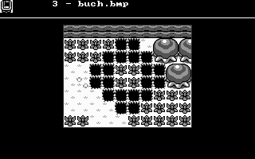
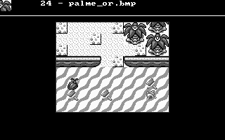

ZeldaPaint
==========

A very simple tile editor written back in August of 1997 with Allegro.
It uses tiles from Zelda: A Links Awakening and allows the creation of
GameBoy-screen sized maps.

Keyboard Commands
-----------------

| Key | Function |
|:---:|----------|
| r   | repaint map |
| ESC | end program |
| c | next tile |
| x | previous tile |
| s | save map |
| l | load map |

Screenshots
-----------

Legal
-----

The source code is published under zlib license and may be freely
reused according to that license. The graphics however are not.

The graphics used within this project were taken from Zelda: A Links
Awakening and are property of Nintendo.
